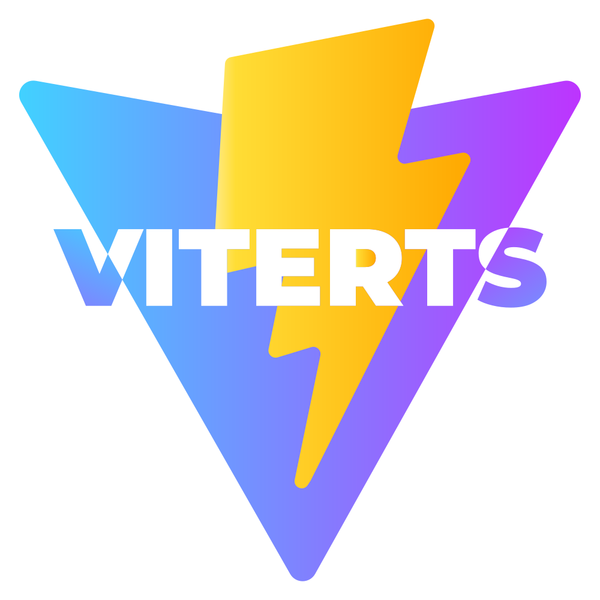

<p align="center">
  <br>
  
  <br>
  <br>
</p>

# Viterts

## Features

- [React](https://reactjs.org/)
- [TypeScript](https://www.typescriptlang.org/) - more strict
- [React Router](https://reactrouter.com/) - with lazy-loading / code-splitting use case
- [Redux Toolkit](https://redux-toolkit.js.org/) - with async and sync use case
- [Ant Design](https://ant.design/)
- [Jest](https://jestjs.io/) with [Testing Library](https://testing-library.com/docs/react-testing-library/intro/)
- [ESLint](https://tailwindcss.com/) - with [airbnb](https://github.com/airbnb/javascript) and really [powerful configuration](./.eslintrc)
- [Prettier](https://prettier.io/) - with editor configuration [file](./.vscode/settings.json)
- [SASS/SCSS](https://sass-lang.com/) with [CSS Modules](https://github.com/css-modules/css-modules)
- [dotenv (.env)](https://github.com/motdotla/dotenv)
- [editorconfig](https://editorconfig.org/)
- JS/TS native fetch get/post/put/delete [helpers](./src/common/request.ts)

## Installation

```bash
npx degit erdoganbulut/viterts my-viterts-app
cd my-viterts-app
yarn # If you don't have yarn installed, run: npm install -g yarn
```

## Checklist

When you use this template, try follow the checklist to update your info properly

- [ ] Rename `name` and `author` fields in `package.json`
- [ ] Change the author name in `LICENSE`
- [ ] Change the title in `index.html`
- [ ] Change the favicon and logo in `src/assets`
- [ ] Remove dummy code and components
- [ ] Clean up the README's

## Available Scripts

In the project directory, you can run:

##### `yarn dev`

##### `yarn build`

##### `yarn preview`

##### `yarn lint`

##### `yarn lint:ts`

##### `yarn lint:eslint`

##### `yarn format:ts`

##### `yarn format`

##### `yarn format:check`

##### `yarn test`

## Development

### Folder Structure

Folder structure should look like this;

```
src/
├── App.test.tsx
├── App.tsx
├── main.tsx
├── setupTests.ts
├── test-utils.ts
├── vite-env.d.ts
├── assets
│   ├── %image%.jpg
│   └── %icon%.svg
├── common
│   ├── request.ts
│   └── %util_name%.ts
├── components
│   ├── partials
│   │   └── %ModuleName%
│   │       ├── %ParticalName%.tsx
│   │       ├── %ParticalName%.test.tsx
│   │       └── %ParticalName%.scss
│   └── shareds
│       └── %ParticalName%
│           ├── %ParticalName%.tsx
│           ├── %ParticalName%.test.tsx
│           └── %ParticalName%.scss
├── routes
│   ├── %ModuleName%
│   │   ├── index.tsx
│   │   ├── index.scss
│   │   ├── %ModuleRouteName%
│   │   │   ├── index.tsx
│   │   │   ├── %ModuleRouteName%.test.tsx
│   │   │   └── %ModuleRouteName%.scss
│   │   └── %ModuleRouteName%
│   │       ├── index.tsx
│   │       ├── %ModuleRouteName%.test.tsx
│   │       └── %ModuleRouteName%.scss
│   └── index.tsx (router)
├── store
│   ├── slices
│   │   ├── %module-name%.slice.ts
│   │   └── %module-name%.slice.ts
│   ├── hooks.ts
│   └── index.ts
└── styles
    ├── global.scss
    └── vendors.scss
```

### State Management

Redux, a state management library, was used for state management in the project. It is divided into redux slices to avoid complexity, ensure maintainability, and divide into domains. Use store (redux) for your global states, states that you will use at many different points, states that you will access and manage remotely.

Go to the `src/store/slices` folder. Open or create the slice file of the module whose state you will manage. If you have created a new slice, you must define it in the `src/store/index.ts` file.

### Style Management

For global styling operations, there are global sass files under the `src/styles` folder. The `vendors.scss` you will use to add your dependencies and `global.scss` for your global styles are located here. You can also create global sass files here that you want to import in other sass files like `shareds.scss` or `variables.scss`.

Components own style files should be located next to the `%componentname%.tsx` file like as `src/routes/Episode/List/List.scss`

### Linter / Eslint

The project has a strong linter configuration to ensure consistency and maintainability. It generally follows the airbnb and prettier configuration.

### Component Structure

All components in the project are created as functional component. Continuity should be ensured by not using class components unless needed.

## Contributors

[Erdoğan BULUT](https://github.com/erdoganbulut/)
[Ömer AYYILDIZ](https://github.com/omerayyildiz)
